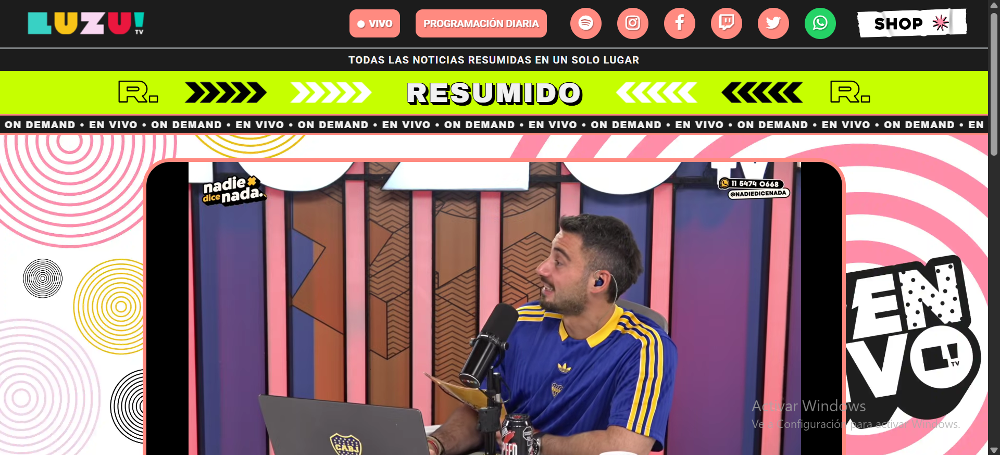
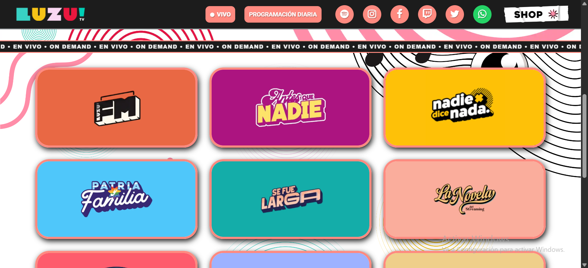
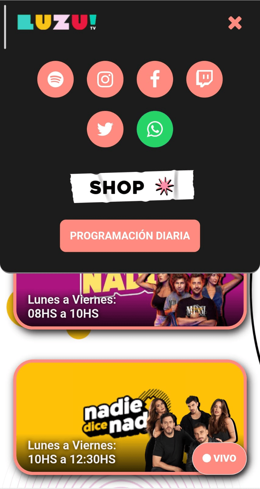
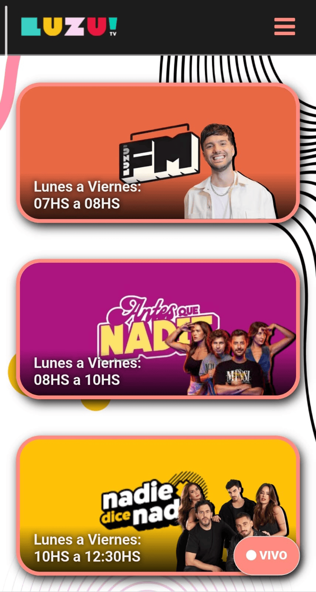

# Proyecto: Rediseño Web LuzuTV

## Introducción
Este proyecto es una página web no oficial inspirada en LuzuTV, creada como rediseño visual y funcional de una experiencia de streaming, radio y programación online.

La página busca reunir en un solo sitio el acceso al vivo, las redes sociales y una galería de programas con sus horarios, fondos visuales y elencos. El objetivo principal es lograr una interfaz moderna, clara, responsive y fácil de navegar desde celular, tablet o escritorio.

## ¿De qué va el proyecto?
El sitio funciona como una fan page de LuzuTV. Incluye una página principal con presentación visual, acceso al streaming en vivo, enlaces a redes sociales y una galería actualizada de programas.

La estructura de imágenes de programas está organizada en carpetas por programa dentro de:

```text
img/programas/programas/
```

Cada programa puede tener su fondo, logo y elenco, lo que permite mantener los assets ordenados y fáciles de actualizar.

## Programas incluidos
Actualmente la galería principal del proyecto muestra 17 programas:

1. Luzu Activa
2. FM
3. Antes que Nadie
4. Nadie Dice Nada
5. El Show del Verano
6. Patria y Familia
7. Se Fue Larga
8. FM al Atardecer
9. La Novela
10. Los del Fondo
11. Los No Talentos
12. Un Sábado Mejor
13. PLP
14. Algo de Música
15. Edición Especial
16. Flasheando Secuencia
17. Luzu Kids

Los programas se ven como tarjetas visuales: cada una usa una imagen de fondo del programa, una capa superpuesta con el horario o estado del contenido, y una imagen del elenco posicionada sobre el fondo. Algunos programas aparecen con días y horarios específicos, mientras que otros figuran como contenido `on demand`.

## Objetivos del proyecto
- Modernizar el diseño para hacerlo atractivo y completamente responsive.
- Optimizar la velocidad de carga y el rendimiento usando imágenes en formato WebP.
- Mejorar la estructura y organización del contenido para facilitar la navegación.
- Mantener una galería de programas actualizable desde una estructura clara de carpetas.
- Incorporar enlaces a redes sociales importantes: Instagram, YouTube, Twitch, TikTok, Twitter y Spotify.
- Mejorar accesibilidad, SEO y presentación en redes mediante meta tags y Open Graph.

## Paleta de colores
La identidad visual del sitio se apoya en una base oscura, texto claro y acentos coral/rosados.

### Colores principales
```css
--bg-color-primario: #f1f1f1;
--bg-color-secundario: #1c1c1c;
--bg-color-icons: #ff8a80;
--bg-color-icons-footer: #9e9e9e;
```

- `#f1f1f1`: gris muy claro usado principalmente para textos.
- `#1c1c1c`: gris oscuro usado como fondo principal en header, footer y secciones.
- `#ff8a80`: coral usado como color de acento en íconos, botones y bordes.
- `#9e9e9e`: gris medio usado en bordes y elementos secundarios.

### Colores secundarios
```css
#25d366
#e10000
#c6ff00
#000000
#ffffff
#b0b0b0
#ff0033
```

- `#25d366`: color asociado al botón de WhatsApp.
- `#e10000`: rojo usado para el botón flotante del vivo.
- `#c6ff00`: acento verde flúor en elementos destacados.
- `#000000`: sombras, overlays y contraste sobre imágenes.
- `#ffffff`: textos o elementos de alto contraste.
- `#b0b0b0`: textos secundarios.
- `#ff0033`: acento rojo/rosado usado en estados o estilos puntuales.

## Proceso de rediseño

### Etapa 1: Análisis inicial
- [x] Revisar la página original.
- [x] Identificar problemas y áreas de mejora.

### Etapa 2: Diseño y maquetación
- [x] Crear estructura base en HTML semántico.
- [x] Aplicar estilos CSS modernos y responsive con Flexbox, Grid y Media Queries.
- [x] Integrar Google Fonts y Font Awesome para tipografía e íconos.
- [x] Organizar assets por secciones y programas.
- [x] Realizar pruebas de responsividad en móviles, tablets y escritorio.

### Etapa 3: Implementación de funcionalidades
- [x] Añadir interactividad con JavaScript, como menú hamburguesa y botones dinámicos.
- [x] Mejorar accesibilidad con atributos `aria-label` y roles adecuados.
- [x] Optimizar SEO mediante meta tags y Open Graph.
- [x] Actualizar la galería de programas con fondos, elencos y horarios.

### Etapa 4: Pruebas y ajustes
- [x] Verificar compatibilidad entre navegadores modernos.
- [x] Realizar pruebas de usabilidad y accesibilidad.
- [x] Optimizar tiempos de carga y rendimiento.
- [x] Revisar rutas de imágenes para evitar assets rotos.

## Resultados finales
- Página web moderna, atractiva y responsive.
- Navegación clara, intuitiva y accesible.
- Galería visual con 17 programas actualizados.
- Estructura de imágenes más ordenada por programa.
- Enlaces sociales visibles y funcionales.
- Rendimiento optimizado para distintos dispositivos.

## Tecnologías utilizadas
- HTML5 semántico
- CSS3
- Flexbox
- CSS Grid
- Media Queries
- JavaScript ES6+
- Google Fonts
- Font Awesome
- Imágenes WebP

## Enlaces útiles
- Página original: [https://luzutv.com.ar/](https://luzutv.com.ar/)
- Documentación Font Awesome: [https://fontawesome.com/v4.7.0/](https://fontawesome.com/v4.7.0/)
- Google Fonts: [https://fonts.google.com/](https://fonts.google.com/)

## Capturas de pantalla del proyecto - vista Desktop
### Página de inicio


### Página de inicio - Contenido (Galería)


## Capturas de pantalla del proyecto - vista Mobile
### Página de inicio


### Menú hamburguesa


### Página de inicio - Contenido (Galería)


